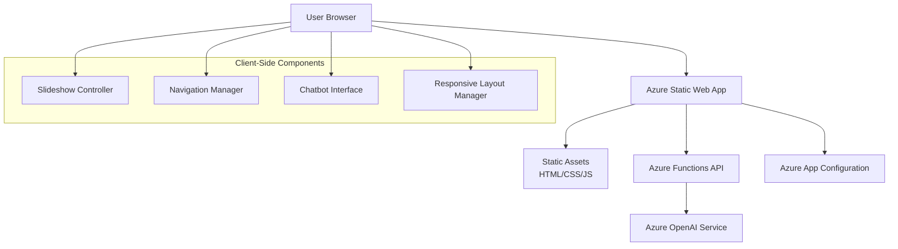

# Design Document

## Overview

"The Cohort Chronicles" is a single-page web application built as an Azure Static Web App that presents an interactive slideshow telling the 17-week MSSA journey. The application combines modern web technologies with Azure cloud services to create an engaging graduation ceremony presentation with AI-powered chatbot functionality.

## Architecture

### High-Level Architecture



### Technology Stack

- **Frontend**: Vanilla HTML5, CSS3, JavaScript (ES6+)
- **Hosting**: Azure Static Web Apps
- **API**: Azure Functions (Node.js) for OpenAI integration
- **AI Service**: Azure OpenAI Service (GPT-4 or GPT-3.5-turbo)
- **Configuration**: Azure App Configuration for secure API key storage
- **Deployment**: GitHub Actions (integrated with Static Web Apps)

## Components and Interfaces

### 1. Slideshow Engine

**Purpose**: Manages slide progression, timing, and transitions

**Key Methods**:
```javascript
class SlideshowEngine {
    constructor(slides, options)
    start()
    pause()
    resume()
    nextSlide()
    previousSlide()
    goToSlide(index)
    updateProgress()
}
```

**Configuration**:
- Auto-advance interval: 10 seconds
- Transition duration: 800ms
- Smooth CSS transitions with easing functions

### 2. Navigation Controller

**Purpose**: Handles user interactions and manual navigation

**Key Methods**:
```javascript
class NavigationController {
    bindEvents()
    handlePlayPause()
    handleNext()
    handlePrevious()
    handleProgressClick(position)
}
```

**UI Elements**:
- Play/Pause toggle button
- Previous/Next navigation buttons
- Interactive progress bar
- Keyboard navigation support (arrow keys, spacebar)

### 3. Chatbot Interface

**Purpose**: Manages AI chatbot modal and conversation flow

**Key Methods**:
```javascript
class ChatbotInterface {
    openModal()
    closeModal()
    sendMessage(message)
    displayResponse(response)
    handleError(error)
}
```

**Features**:
- Modal overlay with chat interface
- Message history display
- Typing indicators
- Error handling and retry mechanisms

### 4. Azure OpenAI Integration

**Purpose**: Serverless API endpoint for chatbot functionality

**Azure Function Structure**:
```javascript
// api/chat/index.js
module.exports = async function (context, req) {
    // Authenticate with Azure OpenAI
    // Process user message
    // Generate contextual response
    // Return formatted response
}
```

**System Prompt Design**:
The chatbot will be configured with a comprehensive system prompt containing:
- Cohort member personalities and backgrounds
- Weekly story details and instructor characteristics
- Military professionalism guidelines
- Response tone and style instructions

## Data Models

### Slide Data Structure

```javascript
const slideData = {
    week: Number,
    title: String,
    content: String,
    imagePlaceholder: String,
    duration: Number, // milliseconds
    metadata: {
        instructors: Array,
        keyTopics: Array,
        milestones: Array
    }
}
```

### Character Profiles

```javascript
const characterProfiles = {
    staff: [
        {
            name: "Fiona Jones",
            role: "Career Development Manager",
            characteristics: ["Swan metaphor", "ProDev expertise", "Full presence focus"],
            demographics: "White British Female"
        },
        // ... other staff members
    ],
    students: [
        {
            name: "Brandon Brown",
            background: "US Navy veteran",
            location: "Sweden",
            characteristics: ["California origin"],
            demographics: "African American Male"
        },
        // ... other students
    ]
}
```

### Chat Message Structure

```javascript
const chatMessage = {
    id: String,
    timestamp: Date,
    sender: "user" | "bot",
    content: String,
    status: "sending" | "sent" | "error"
}
```

## User Interface Design

### Layout Structure

```
┌─────────────────────────────────────────┐
│              Header Bar                 │
│         "The Cohort Chronicles"         │
├─────────────────────────────────────────┤
│                                         │
│            Main Slide Area              │
│                                         │
│  ┌─────────────────────────────────┐    │
│  │        Slide Content            │    │
│  │                                 │    │
│  │  Title: Week X                  │    │
│  │  Content: Story text...         │    │
│  │  [Image Placeholder]            │    │
│  └─────────────────────────────────┘    │
│                                         │
├─────────────────────────────────────────┤
│  Progress Bar: [████████░░░░░░░░░░]     │
├─────────────────────────────────────────┤
│  Controls: [◀] [⏸] [▶]    [Ask Cohort] │
└─────────────────────────────────────────┘
```

### Color Scheme

**Primary Colors**:
- Navy Blue: #1e3a8a (headers, buttons)
- Steel Blue: #3b82f6 (accents, progress bar)
- Charcoal Gray: #374151 (text, backgrounds)
- Light Gray: #f3f4f6 (backgrounds, cards)

**Military Accents**:
- Gold: #fbbf24 (highlights, achievements)
- Silver: #9ca3af (secondary elements)

### Typography

- **Headers**: 'Segoe UI', system-ui, sans-serif
- **Body Text**: 'Inter', 'Segoe UI', system-ui, sans-serif
- **Monospace**: 'Consolas', 'Monaco', monospace (for code references)

### Responsive Breakpoints

- **Desktop**: 1024px and above
- **Tablet**: 768px - 1023px
- **Mobile**: 320px - 767px

## Error Handling

### Client-Side Error Handling

1. **Network Failures**:
   - Retry mechanism for API calls
   - Offline detection and user notification
   - Graceful degradation when chatbot unavailable

2. **Slideshow Errors**:
   - Fallback content for missing images
   - Error recovery for corrupted slide data
   - Automatic restart on critical failures

3. **User Input Validation**:
   - Chat message length limits
   - XSS prevention in user inputs
   - Rate limiting for API calls

### Server-Side Error Handling

1. **Azure OpenAI API Errors**:
   - Rate limit handling with exponential backoff
   - Token limit management
   - Service unavailability fallbacks

2. **Authentication Errors**:
   - API key validation
   - Managed identity fallbacks
   - Clear error messages for configuration issues

## Testing Strategy

### Unit Testing

**Frontend Components**:
- Slideshow engine logic
- Navigation controller functions
- Chatbot interface methods
- Responsive layout calculations

**Testing Framework**: Jest with jsdom for DOM testing

### Integration Testing

**API Integration**:
- Azure OpenAI service connectivity
- Error handling scenarios
- Response formatting validation

**Cross-Browser Testing**:
- Chrome, Firefox, Safari, Edge
- Mobile browser compatibility
- Presentation mode testing

### End-to-End Testing

**User Workflows**:
- Complete slideshow progression
- Manual navigation scenarios
- Chatbot conversation flows
- Responsive design validation

**Testing Tools**: Playwright for automated browser testing

### Performance Testing

**Metrics to Monitor**:
- Page load time (target: <3 seconds)
- Slide transition smoothness (60fps)
- API response time (target: <2 seconds)
- Memory usage optimization

**Testing Approach**:
- Lighthouse performance audits
- Network throttling tests
- Memory leak detection
- Load testing for API endpoints

## Security Considerations

### API Security

1. **Authentication**:
   - Azure Managed Identity for service-to-service calls
   - API key rotation strategy
   - CORS configuration for Static Web Apps

2. **Input Validation**:
   - Sanitize all user inputs
   - Rate limiting on chat endpoints
   - Content filtering for inappropriate messages

### Data Protection

1. **Privacy**:
   - No persistent storage of chat conversations
   - Minimal data collection
   - GDPR compliance considerations

2. **Content Security**:
   - Content Security Policy headers
   - XSS prevention measures
   - Safe handling of dynamic content

## Deployment Architecture

### Azure Static Web Apps Configuration

```yaml
# staticwebapp.config.json
{
  "routes": [
    {
      "route": "/api/*",
      "allowedRoles": ["anonymous"]
    }
  ],
  "navigationFallback": {
    "rewrite": "/index.html"
  },
  "mimeTypes": {
    ".json": "application/json"
  }
}
```

### Environment Configuration

**Development**:
- Local Azure Functions Core Tools
- Environment variables for API keys
- Hot reload for rapid development

**Production**:
- Azure App Configuration for secrets
- CDN integration for static assets
- Application Insights for monitoring

### CI/CD Pipeline

**GitHub Actions Workflow**:
1. Code quality checks (ESLint, Prettier)
2. Unit and integration tests
3. Build optimization
4. Deployment to Azure Static Web Apps
5. Post-deployment validation tests

## Performance Optimization

### Frontend Optimization

1. **Asset Optimization**:
   - Image compression and lazy loading
   - CSS and JavaScript minification
   - Critical CSS inlining

2. **Runtime Performance**:
   - Efficient DOM manipulation
   - Debounced user interactions
   - Memory leak prevention

### Backend Optimization

1. **API Performance**:
   - Response caching strategies
   - Connection pooling
   - Optimized Azure OpenAI prompts

2. **Scalability**:
   - Azure Functions consumption plan
   - Auto-scaling configuration
   - Regional deployment considerations