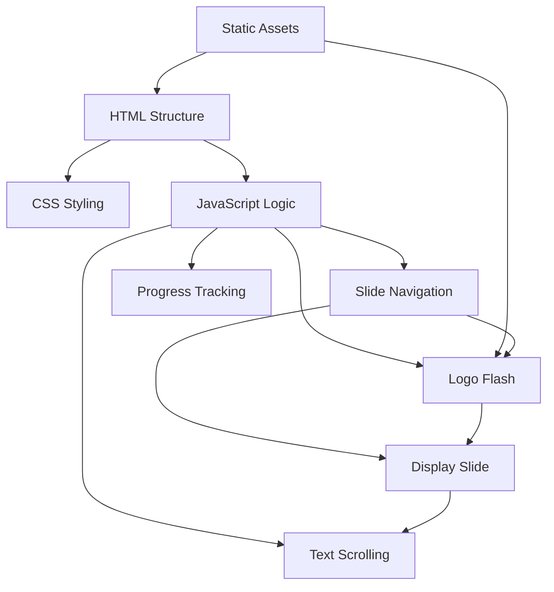
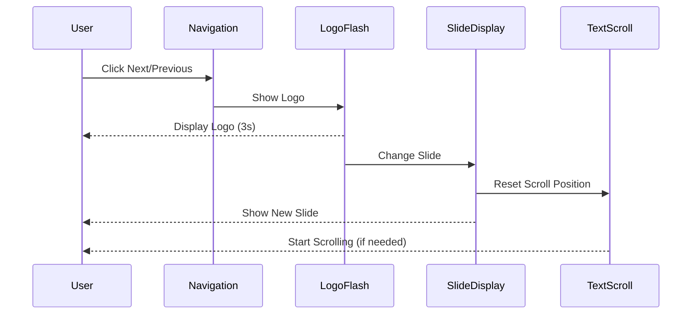
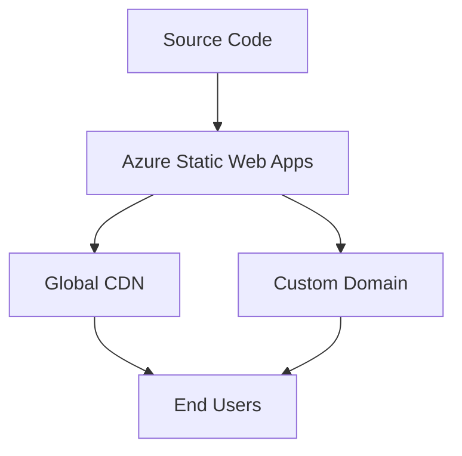

# Design Document: Website Cleanup and Enhancement

## Overview

This design document outlines the approach for cleaning up and enhancing the MSSA Cohort Chronicles website. The primary goals are to remove the chatbot functionality, fix deployment issues, update slide content, add text scrolling capabilities, and implement a logo flash feature between slide transitions. The design focuses on maintaining the core slideshow functionality while implementing these changes.

## Architecture

The website follows a simple client-side architecture with the following components:

1. **HTML Structure** - Defines the layout and content elements
2. **CSS Styling** - Handles the visual presentation and animations
3. **JavaScript Logic** - Controls the slideshow functionality, navigation, and interactions
4. **Static Assets** - Images and other resources used in the presentation

The current architecture includes chatbot functionality that will be removed, and the deployment configuration will be optimized for Azure Static Web Apps.

## Components and Interfaces

### 1. HTML Structure

The HTML structure will be modified to:
- Remove all chatbot-related elements (chat trigger button, chat modal, etc.)
- Maintain the slideshow container and navigation controls
- Update the slide content with the new text for each slide
- Add containers for the logo flash feature

```html
<!-- Main Structure After Changes -->
<body>
  <header>...</header>
  
  <main>
    <!-- Progress Bar Section -->
    <section class="progress-section">...</section>
    
    <!-- Slideshow Section -->
    <section class="slideshow-section">
      <div class="slideshow-container">
        <div class="slideshow">
          <div class="slide active">...</div>
        </div>
      </div>
    </section>
    
    <!-- Logo Flash Container (New) -->
    <div class="logo-flash" id="logoFlash">
      
    </div>
    
    <!-- Navigation Controls -->
    <section class="controls-section">...</section>
    
    <!-- Logo Gallery Section (New) -->
    <section class="logo-gallery-section">
      <div class="logo-gallery-container">
        <h3 class="logo-gallery-title">Cohort Logo Concepts</h3>
        <div class="logo-gallery" id="logoGallery">
          <!-- Logo images 7-12 and main will be inserted here -->
        </div>
      </div>
    </section>
  </main>
</body>
```

### 2. CSS Styling

The CSS will be updated to:
- Remove chatbot-related styles
- Add styles for text scrolling functionality
- Add styles for the logo flash feature
- Ensure responsive design is maintained

```css
/* New CSS for Text Scrolling */
.slide__text-container {
  max-height: 200px;
  overflow: hidden;
  position: relative;
}

.slide__text {
  position: relative;
  transition: transform 0.5s ease;
}

.slide__text.scrolling {
  animation: textScroll var(--scroll-duration, 30s) linear;
}

@keyframes textScroll {
  0% { transform: translateY(0); }
  100% { transform: translateY(calc(-100% + 200px)); }
}

/* New CSS for Logo Flash */
.logo-flash {
  position: fixed;
  top: 0;
  left: 0;
  width: 100%;
  height: 100%;
  background: rgba(0, 0, 0, 0.8);
  display: flex;
  align-items: center;
  justify-content: center;
  z-index: 1000;
  opacity: 0;
  visibility: hidden;
  transition: opacity 0.3s ease, visibility 0.3s ease;
}

.logo-flash.active {
  opacity: 1;
  visibility: visible;
}

.logo-flash img {
  max-width: 80%;
  max-height: 80%;
  object-fit: contain;
}

/* New CSS for Logo Gallery */
.logo-gallery-section {
  padding: 2rem 0;
  background: var(--background-light, #f5f5f5);
}

.logo-gallery-container {
  max-width: 1200px;
  margin: 0 auto;
  padding: 0 1rem;
}

.logo-gallery-title {
  text-align: center;
  margin-bottom: 1.5rem;
  font-size: 1.5rem;
  color: var(--text-color, #333);
}

.logo-gallery {
  display: grid;
  grid-template-columns: repeat(auto-fit, minmax(200px, 1fr));
  gap: 1.5rem;
  justify-items: center;
}

.logo-gallery-item {
  background: white;
  padding: 1rem;
  border-radius: 0.5rem;
  box-shadow: 0 4px 6px rgba(0,0,0,0.1);
  transition: transform 0.3s ease;
  display: flex;
  flex-direction: column;
  align-items: center;
}

.logo-gallery-item:hover {
  transform: translateY(-5px);
}

.logo-gallery-item img {
  max-width: 100%;
  height: auto;
  margin-bottom: 0.5rem;
}

.logo-gallery-item.main {
  grid-column: 1 / -1;
  max-width: 300px;
  margin: 0 auto;
}
```

### 3. JavaScript Logic

The JavaScript will be modified to:
- Remove all chatbot-related functions and initialization
- Add text scrolling functionality
- Implement the logo flash feature between slide transitions
- Fix any issues with the slideshow functionality

```javascript
// Main Application Structure After Changes
// 1. Application State
let currentSlideIndex = 0;
let isPlaying = true;
let autoAdvanceTimer = null;
let slideSpeed = 8000; // 8 seconds default
let logoFlashTimer = null;
let currentLogoIndex = 0; // Track which logo to show next

// 2. DOM Elements
let slideElement, slideTitle, slideText, slideImage;
let prevBtn, nextBtn, playPauseBtn, speedSelect;
let progressBar, progressFill, progressLabel, progressPercentage, progressSegments;
let logoFlash, logoFlashImage;

// 3. Initialize Application
function initializeApplication() {
  // Get DOM elements
  getDOMElements();
  
  // Initialize slideshow
  initializeSlideshow();
  
  // Initialize navigation
  initializeNavigation();
  
  // Initialize progress bar
  initializeProgressBar();
  
  // Initialize text scrolling
  initializeTextScrolling();
  
  // Initialize logo flash
  initializeLogoFlash();
  
  // Start slideshow
  startSlideshow();
  
  // Hide loading screen
  hideLoadingScreen();
}

// 4. Text Scrolling Functions
function initializeTextScrolling() {
  // Check text height and enable scrolling if needed
  checkTextOverflow();
}

function checkTextOverflow() {
  if (!slideText) return;
  
  const container = slideText.parentElement;
  const textHeight = slideText.scrollHeight;
  const containerHeight = container.clientHeight;
  
  if (textHeight > containerHeight) {
    // Calculate scroll duration based on text length
    const scrollDuration = Math.max(20, textHeight / 20) + 's';
    slideText.style.setProperty('--scroll-duration', scrollDuration);
    slideText.classList.add('scrolling');
  } else {
    slideText.classList.remove('scrolling');
  }
}

// 5. Logo Flash Functions
function initializeLogoFlash() {
  logoFlash = document.getElementById('logoFlash');
  logoFlashImage = document.getElementById('logoFlashImage');
  
  // Initialize logo gallery
  initializeLogoGallery();
}

function showLogoFlash() {
  if (!logoFlash || !logoFlashImage) return;
  
  // Use logos in sequence (1-6) for flash transitions
  const logo = flashLogoImages[currentLogoIndex];
  logoFlashImage.src = logo.src;
  logoFlashImage.alt = logo.alt;
  
  // Update index for next logo
  currentLogoIndex = (currentLogoIndex + 1) % flashLogoImages.length;
  
  // Show logo flash
  logoFlash.classList.add('active');
  
  // Hide after 3 seconds
  logoFlashTimer = setTimeout(() => {
    logoFlash.classList.remove('active');
  }, 3000);
}

// 6. Logo Gallery Functions
function initializeLogoGallery() {
  const logoGallery = document.getElementById('logoGallery');
  if (!logoGallery) return;
  
  // Clear existing content
  logoGallery.innerHTML = '';
  
  // Add display logos (7-12)
  displayLogoImages.forEach((logo, index) => {
    const logoItem = document.createElement('div');
    logoItem.className = 'logo-gallery-item';
    
    // Add 'main' class to the main logo
    if (logo.src.includes('main.png')) {
      logoItem.className += ' main';
    }
    
    const img = document.createElement('img');
    img.src = logo.src;
    img.alt = logo.alt;
    
    logoItem.appendChild(img);
    logoGallery.appendChild(logoItem);
  });
}

// 6. Modified Navigation Functions
function nextSlide() {
  // Show logo flash before changing slide
  showLogoFlash();
  
  // Change slide after logo flash
  setTimeout(() => {
    const nextIndex = (currentSlideIndex + 1) % slideData.length;
    displaySlide(nextIndex);
  }, 3000);
}

// Other functions remain similar but with chatbot functionality removed
```

### 4. Deployment Configuration

The deployment configuration will be updated to:
- Remove API-related settings
- Optimize routing for static content
- Ensure proper caching and performance settings

```json
// staticwebapp.config.json
{
  "routes": [
    {
      "route": "/*",
      "serve": "/index.html",
      "statusCode": 200
    }
  ],
  "navigationFallback": {
    "rewrite": "/index.html",
    "exclude": ["/images/*.{png,jpg,gif}", "/css/*", "/*.css", "/*.js"]
  },
  "responseOverrides": {
    "404": {
      "rewrite": "/index.html"
    }
  },
  "globalHeaders": {
    "content-security-policy": "default-src 'self'; img-src 'self'; script-src 'self'; style-src 'self';",
    "cache-control": "public, max-age=31536000"
  }
}
```

## Data Models

### Slide Data Model

The slide data model will be updated to include the new content for each slide:

```javascript
const slideData = [
  {
    week: 1,
    weekRange: "Introduction",
    title: "Lock, Stock, and Two Smoking Servers: A MSSA Odyssey",
    content: "Who's on the call?\n\nBrandon Brown – California → Sweden • U.S. Navy vet • bottomless energy & pop‑culture hype‑man\n\nFrank Taylor – Fiji → UK • ex‑British Army • quiet curator of FYI links and supportive nods\n\nFortune Tofa – Zimbabwe → UK • retiring British Army • unfailingly courteous (\"very many thanks\")\n\n[...more content...]",
    image: "images/1.png",
    imagePlaceholder: "Comic-book style panel showing a diverse group of military veterans in uniform transitioning to casual tech attire, gathered around glowing computer screens. In the background, a calendar flips from April 7 to August 1, 2025, with Azure clouds and PowerShell code swirling like a storm. Title text overlays: \"Lock, Stock, and Two Smoking Servers.\""
  },
  // Additional slides with updated content
]
```

### Logo Images Model

A new data model for logo images will be added:

```javascript
// Flash logos (shown between slide transitions)
const flashLogoImages = [
  {
    src: "images/logos/1.png",
    alt: "Cohort Logo Concept 1"
  },
  {
    src: "images/logos/2.png",
    alt: "Cohort Logo Concept 2"
  },
  {
    src: "images/logos/3.png",
    alt: "Cohort Logo Concept 3"
  },
  {
    src: "images/logos/4.png",
    alt: "Cohort Logo Concept 4"
  },
  {
    src: "images/logos/5.png",
    alt: "Cohort Logo Concept 5"
  },
  {
    src: "images/logos/6.png",
    alt: "Cohort Logo Concept 6"
  }
];

// Display logos (shown in the page layout)
const displayLogoImages = [
  {
    src: "images/logos/7.png",
    alt: "Cohort Logo Concept 7"
  },
  {
    src: "images/logos/8.png",
    alt: "Cohort Logo Concept 8"
  },
  {
    src: "images/logos/9.png",
    alt: "Cohort Logo Concept 9"
  },
  {
    src: "images/logos/10.png",
    alt: "Cohort Logo Concept 10"
  },
  {
    src: "images/logos/11.png",
    alt: "Cohort Logo Concept 11"
  },
  {
    src: "images/logos/12.png",
    alt: "Cohort Logo Concept 12"
  },
  {
    src: "images/logos/main.png",
    alt: "Cohort Main Logo"
  }
];
```

## Error Handling

Error handling will be improved to:
- Gracefully handle missing images or resources
- Provide fallback options for text scrolling if animations aren't supported
- Log errors to console for debugging
- Ensure the slideshow continues to function even if some features fail

```javascript
// Error handling for image loading
function loadSlideImage(slide) {
  const img = new Image();
  img.onload = () => {
    slideImage.src = img.src;
    slideImage.alt = slide.imagePlaceholder;
  };
  img.onerror = () => {
    console.error(`Failed to load image: ${slide.image}`);
    // Use placeholder instead
    slideImage.src = '';
    slideImage.alt = slide.imagePlaceholder;
    // Show placeholder text
    const placeholder = document.querySelector('.image-placeholder');
    if (placeholder) {
      placeholder.textContent = slide.imagePlaceholder;
      placeholder.style.display = 'flex';
    }
  };
  img.src = slide.image;
}

// Error handling for logo flash
function showLogoFlash() {
  try {
    if (!logoFlash || !logoFlashImage) return;
    
    // Select random logo
    const randomLogo = logoImages[Math.floor(Math.random() * logoImages.length)];
    
    // Set image source with error handling
    logoFlashImage.onerror = () => {
      console.error(`Failed to load logo: ${randomLogo}`);
      logoFlash.classList.remove('active');
    };
    
    logoFlashImage.src = randomLogo;
    
    // Show logo flash
    logoFlash.classList.add('active');
    
    // Hide after 3 seconds
    logoFlashTimer = setTimeout(() => {
      logoFlash.classList.remove('active');
    }, 3000);
  } catch (error) {
    console.error('Error in logo flash:', error);
    // Continue with slide transition even if logo flash fails
    const nextIndex = (currentSlideIndex + 1) % slideData.length;
    displaySlide(nextIndex);
  }
}
```

## Testing Strategy

The testing strategy will focus on:

1. **Unit Testing**
   - Test individual functions for slide navigation
   - Test text scrolling functionality
   - Test logo flash feature
   - Verify progress bar updates correctly

2. **Integration Testing**
   - Test the complete slideshow flow
   - Verify slide transitions with logo flash
   - Test responsive design on different screen sizes

3. **Deployment Testing**
   - Test deployment to Azure Static Web Apps
   - Verify all resources load correctly
   - Check for any 404 errors or missing resources

4. **Manual Testing**
   - Verify visual appearance matches design
   - Test keyboard navigation
   - Test accessibility features
   - Verify text scrolling speed is appropriate for reading

### Test Cases

1. **Chatbot Removal Test**
   - Verify no chatbot button is visible
   - Check that no chatbot-related JavaScript is loaded
   - Verify no chatbot-related network requests are made

2. **Slide Content Test**
   - Verify each slide displays the correct content
   - Check that text formatting is preserved
   - Verify image placeholders work correctly

3. **Text Scrolling Test**
   - Verify long text scrolls at a readable pace
   - Check that scrolling resets when changing slides
   - Test scrolling behavior on different screen sizes

4. **Logo Flash Test**
   - Verify logo appears between slide transitions
   - Check that logo displays for exactly 3 seconds
   - Verify different logos are shown in sequence

5. **Deployment Test**
   - Deploy to Azure Static Web Apps
   - Verify the site loads correctly (no "Congratulations" message)
   - Check that all resources are loaded without errors

## Diagrams

### Component Interaction Diagram



### Slide Transition Flow



### Deployment Architecture



## Implementation Considerations

1. **Performance Optimization**
   - Minimize JavaScript execution time
   - Optimize image loading with proper sizing and formats
   - Use CSS transitions instead of JavaScript animations where possible
   - Implement lazy loading for images

2. **Accessibility**
   - Maintain ARIA attributes for screen readers
   - Ensure keyboard navigation works properly
   - Provide sufficient color contrast
   - Add appropriate alt text for images

3. **Browser Compatibility**
   - Test on modern browsers (Chrome, Firefox, Safari, Edge)
   - Use standard CSS and JavaScript features
   - Provide fallbacks for unsupported features

4. **Mobile Responsiveness**
   - Adjust text scrolling speed on mobile devices
   - Ensure logo flash is visible on smaller screens
   - Optimize navigation controls for touch interfaces

5. **Deployment Optimization**
   - Configure proper caching headers
   - Optimize asset delivery through CDN
   - Set up proper routing for single-page application
   - Remove unnecessary API configurations